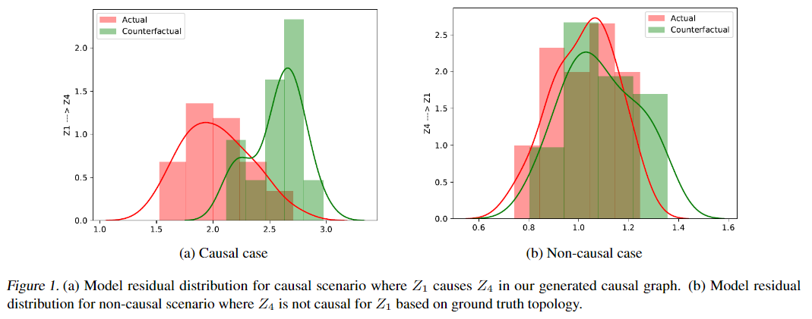

# Causal Discovery using Model Invariance (CDMI)

This repository contains code for our paper accepted in ICML Workshop 2022 on Spurious Correlations, Invariance and Stability (SCIS): Causal Discovery using Model Invariance 
via Knockoffs by Wasim Ahmad, Maha Shadaydeh and Joachim Denzler.

- The work can be cited using below citation information.

```
@inproceedings{
ahmad2022causal,
title={Causal Discovery using Model Invariance through Knockoff Interventions},
author={Wasim Ahmad and Maha Shadaydeh and Joachim Denzler},
booktitle={ICML 2022: Workshop on Spurious Correlations, Invariance and Stability},
year={2022},
url={https://openreview.net/forum?id=OcNeMVbIdCF}
}
```


## Overview

We discover full causal graph in multivariate nonlinear systems by testing model invariance against Knockoffs-based interventional environments:
1. First we train deep network  using data from observational environment .
2. Then we expose the model to Knockoffs-based interventional environments . 
3. For each pair variables {, } in nonlinear system, we test model invariance across environments. 
4. We perform KS test over distribution ,  of model residuals in various environments. 
Our NULL hypothesis is that variable  does not cause , 
:  = , 
else the alternate hypothesis :  !=   is accepted.

<p align="center">

</p>

## Data
We test our method on synthetic as well as real data which can be found under `datasets/` directory. The synthetic data is generated using file `src/synthetic_dataset.py`. 
The real data we used is average daily discharges of rivers in the upper Danube basin, measurements of which are made available by the Bavarian Environmental Agency at
https://www.gkd.bayern.de.


## Code
`src/main.py` is our main file, where we model multivariate non-linear data using deep networks.
- `src/deepcause.py` for actual and counterfactual outcome generation using interventions.
- `src/preprocessing.py` for data loading and preprocessing.
- `src/knockoffs.py` generate knockoffs of the original variables.
- `src/daignostics.py` to determine the goodness of the generated knockoff copies.
- `DeepKnockoffs/` contains the knockoffs generation methods.
- `datasets/` contains the generated synthetic data and real dataset.
- `model/` contains trained models that we used for different datasets.

We also extend CDMI to discover causal graph in non-stationary time series. To do that, first we segment multivariate non-stationary time series based on their dynamics using [Regime Identification](https://github.com/wasimahmadpk/RegimeIdentification) method and perform regime-oriented causal discovery.

## Dependencies
`requirements.txt` contains all the packages that are related to the project.
To install them, simply create a new [conda](https://docs.conda.io/en/latest/) environment and type
```
pip install -r requirements.txt
```


## Acknowledgement

This work is funded by the Carl Zeiss Foundation within the scope of the program line "Breakthroughs: Exploring Intelligent Systems" for "Digitization — explore the basics, use applications" and the DFG grant SH 1682/1-1.
